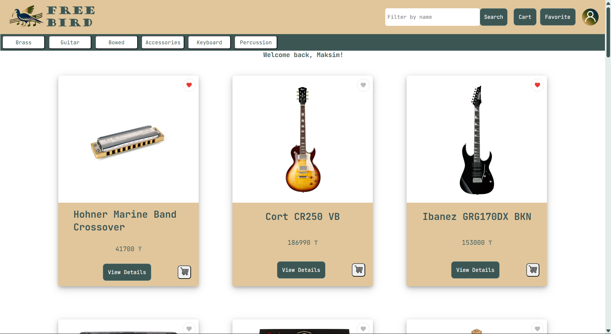
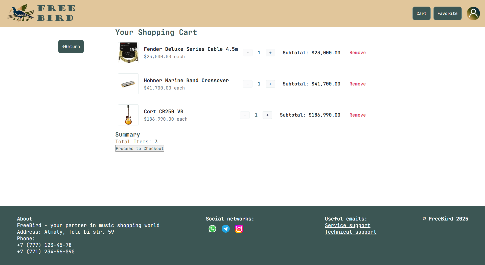
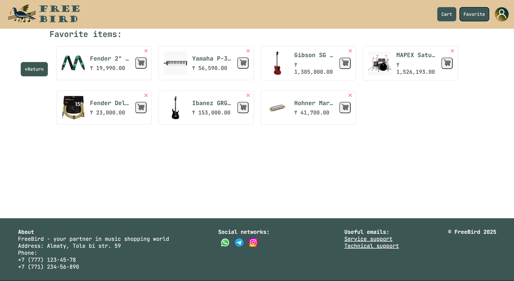

# WebDevMusic


## Description
Team of Timur, Gleb, and Maxim. WebDevMusic is a web application demonstrating a full-stack implementation using Angular for the frontend and Django for the backend. It allows users to like products to their favorites, add them  to cart and make orders. This project serves as our final submission for the WebDev course, showcasing our ability to integrate frontend and backend technologies.

## Table of Contents
- [Tech Stack](#tech_stack)
- [Installation](#installation)
- [Screenshots](#screenshots)
- [Authors](#authors)

## Tech Stack

* **Frontend:** Angular, TypeScript, HTML, CSS
* **Backend:** Django, Python
* **Database:** SQLite
* **API:** Django REST Framework (*if used*)
* **Environment Management:** Python `venv`
* **Package Managers:** `pip`, `npm`

## Installation
To get a local copy up and running, follow these simple steps:

1. Clone the repository:
    ```sh
    git clone https://github.com/mossimka/WebDevMusic.git
    ```
2. Navigate to the project directory:
    ```sh
    cd WebDevMusic
    ```
3. Activate virtual environment:
   ```sh
   .venv\Scripts\Activate
    ```
5. Start django server:
   ```sh
   cd FreeBird
   py manage.py runserver
    ```
6. Start angular server:
   Go to root folder
   ```sh
   cd music-shop
   ng serve
   ```
## Screenshots

*Main page*



*Cart page*



*Favorites Page*



## Authors

This project is developed and maintained by:

- Timur Manarbaev @fendcg
- Gleb Yurtaev @Gleb-Y
- Maxim Sarsekeyev @mossimka
